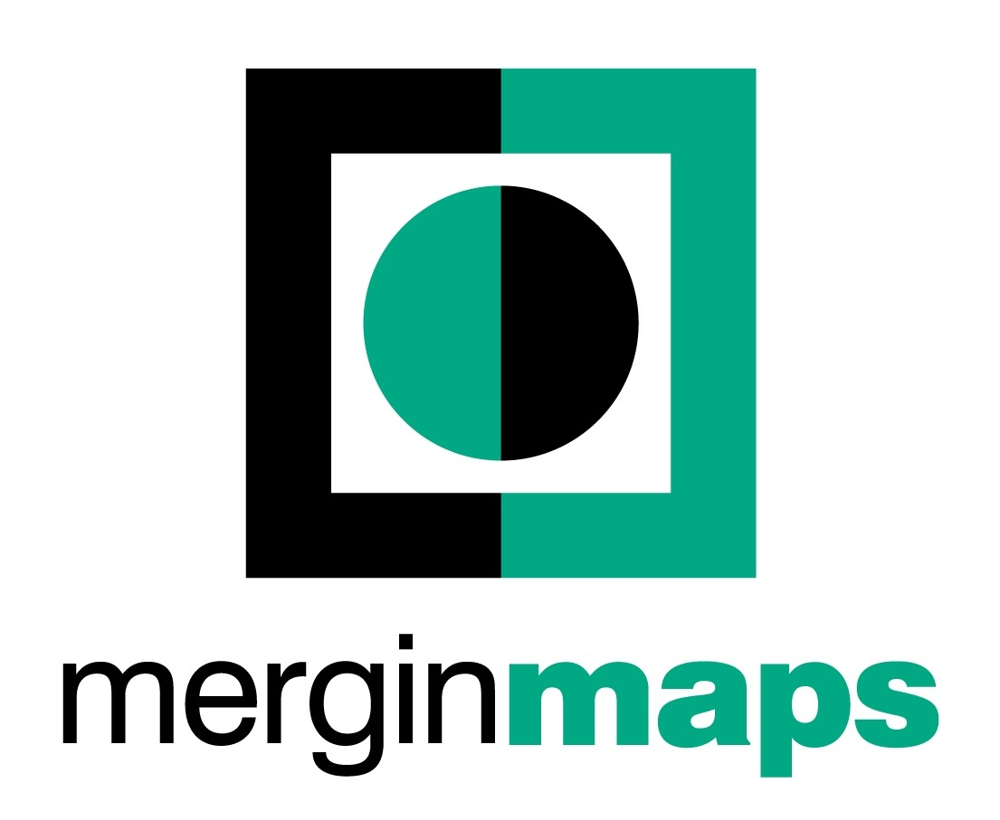
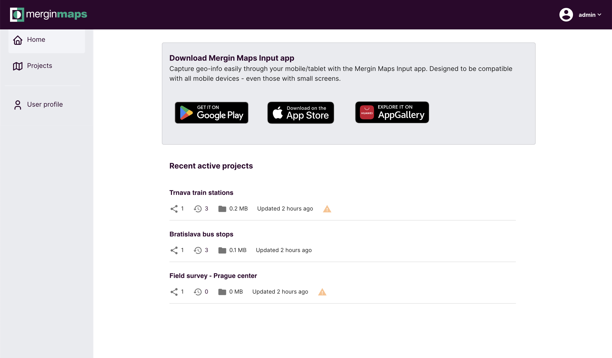
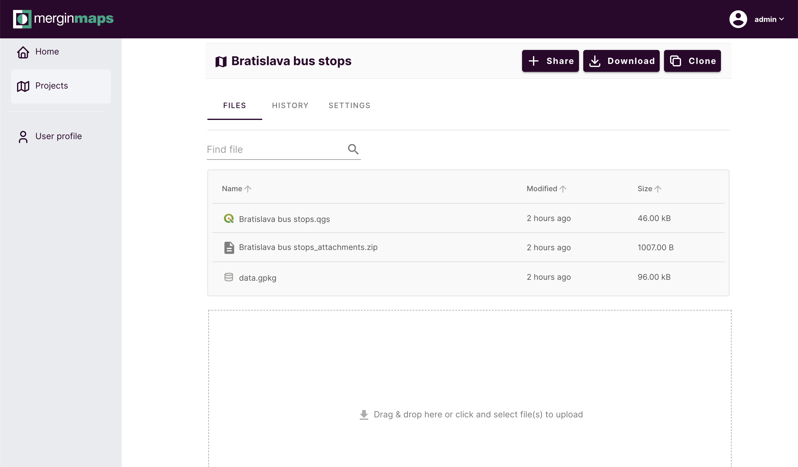
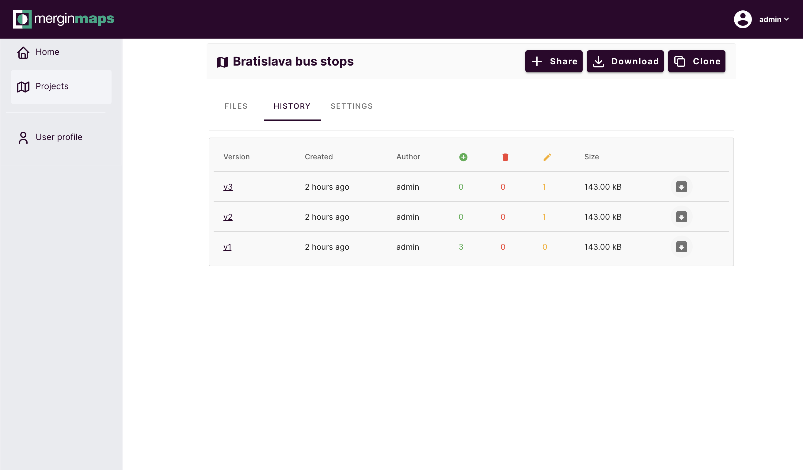
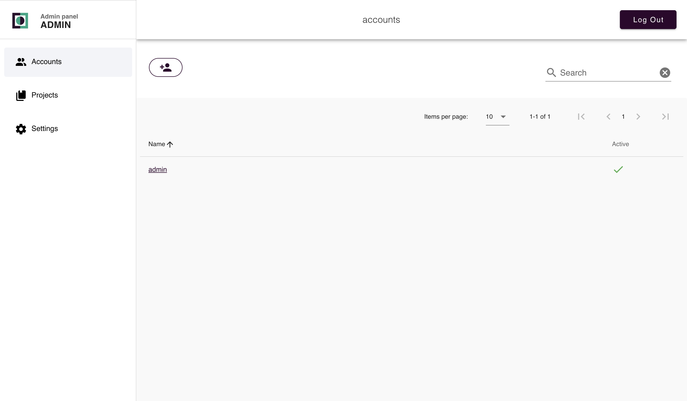
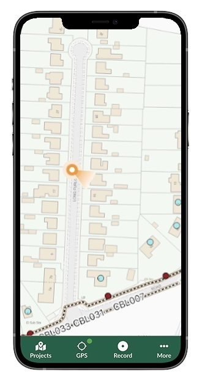
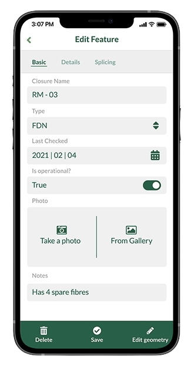
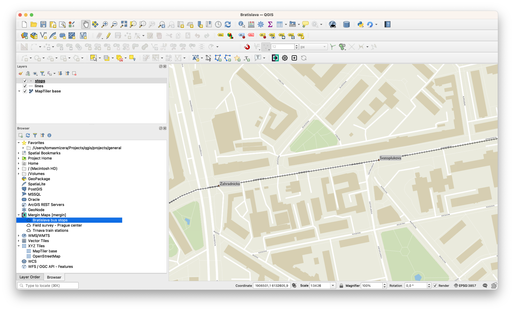

	<a href="https://merginmaps.com/" target="_blank">
		<picture>
			<source media="(prefers-color-scheme: dark)" srcset="./doc/mm_logo_bgnd_neg.png" width=350>
			<source media="(prefers-color-scheme: light)" srcset="./doc/mm_logo_bgnd_pos.jpg" width=350>
			
		</picture>
	</a>

	<b>Store and track changes to your geo-data</b>

## About

Mergin Maps is a web platform for storage and synchronisation of geospatial projects across multiple users and devices (desktop and mobile).
The platform is especially useful when you need:

- **Mobile data collection.** If you need to capture location of assets (and their attributes) or update an existing database.

- **Data sharing.** No complicated setup of access by IT admins to get your data to colleagues or clients. Set up permissions and send invites with few clicks.

- **Offline access.** Work with data with no interruption even without constant Internet connection - sync any changes when you are back online.

- **Collaborative editing.** No more problems dealing with multiple copies of the same dataset in different versions - all changes are automatically consolidated in one place.

- **Audit changes.** Knowing who has changed what and when in a database is often important - Mergin Maps keeps track of the history and allows to go back if needed.

- **No coding required.** Everything can be set up with no knowledge of programming.

Mergin Maps organises all data in projects. A project in Mergin Maps is a directory containing various data files - GeoPackages,
QGIS project files, documents, pictures and more. As soon as a project is uploaded to Mergin Maps, it can be easily accessed directly from the web, from QGIS or from iOS/Android via our [mobile app](https://merginmaps.com/start-for-free).

You are currently browsing repository for Mergin Maps web server and web client. Our mobile app, QGIS plugin and integrations have standalone GitHub repositories, you can [find them here](https://github.com/MerginMaps).

## Screenshots

<b>Mergin Maps web</b> 
<table align="center">
<tr>
	<td align="center"> Dashboard</td>
	<td align="center"> Project detail</td>
</tr>
<tr>
	<td align="center"> Project version history</td>
	<td align="center"> Admin interface</td>
</tr>
</table>

<b>Mergin Maps mobile app</b> 

<table align="center">
<tr>
	<td align="center"> QGIS map on mobile</td>
	<td align="center"> Feature form</td>
</tr>
</table>

<b>Mergin Maps QGIS plugin</b> 

## Features

- 🌍 **Store data** - GeoPackages, QGIS project files, GeoTIFFs, pictures or any other data easily
- 📱 **Mobile devices** - Great for working on field surveys, thanks to our mobile app based on QGIS, for [iOS and Android](https://github.com/lutraconsulting/input)
- 🌟 **QGIS integration** - [Mergin Maps plugin](https://github.com/lutraconsulting/qgis-mergin-plugin) is available to help with project setup and seamless syncing within QGIS
- 👥 **Multi-user editing** - Changes to vector/attribute data from multiple users are automatically merged
- 📖 **Data versioning** - Keeping history of all changes, allowing to go back if needed
- 🔌 **Offline editing** - Clients do not need to be online all the time - only when syncing changes
- 🌱 **Sharing with collaborators** - Projects can be shared with other team members
- 🏰 **Permission system** - Decide who can read, write or manage projects
- 🌈 **Web interface** - Simple user interface to view and manage projects
- ⚡️ **Fast** - Efficient sync protocol transfering data between clients and server
- 🧑‍💻 **Developer friendly** - Mergin Maps is open platform. CLI tools and client libraries are available for [Python](https://github.com/lutraconsulting/mergin-py-client) and [C++](https://github.com/lutraconsulting/mergin-cpp-client)
- :camera: **Sync images** - Supporting sync of photos with common cloud storage using [mergin-media-sync](https://github.com/lutraconsulting/mergin-media-sync) tool
- 💽 **Sync with database** - Supporting two-way sync of data with PostGIS using [mergin-db-sync](https://github.com/lutraconsulting/mergin-db-sync) tool
- 👷‍♀️ **Work packages** - Split main database to smaller chunks for teams using [mergin-work-packages](https://github.com/lutraconsulting/mergin-work-packages) tool

Mergin Maps offers a unique combination of features that other tools do not provide out of the box:

- relational databases (such as PostGIS or Oracle) are great for keeping a central repository of spatial data, but offline access, versioning and sharing outside of a single organisation are complicated to set up.

- traditional storage products (like Dropbox or Google Drive) are great for storage of large amounts of data (pictures/videos) and offering offline access, but concurrent access to data (e.g. a single vector layer) is not going to work well.

## Quick start

Try Mergin Maps at https://merginmaps.com/ - the SaaS service run by Lutra Consulting, the makers of Mergin Maps.

### Running locally

A step-by-step guide how to run local Mergin Maps instance can be found in our [documentation](https://merginmaps.com/docs/dev/mergince/). 

### Manage Mergin Maps

Admin users can enter the admin interface available at `/admin` URL which provides management of users, projects and other bits of the Mergin Maps instance.

### Contributing

Contributions are welcomed! You can set up development environment by following a guide in [development.md](./development.md). Before you create your first pull request, we kindly ask you to sign the CLA with your GitHub user name and date [here](LICENSES/CLA-signed-list.md).

## Documentation

For user help and documentation, visit https://merginmaps.com/docs
If you'd like to contribute and improve the documentation, visit https://github.com/MerginMaps/docs

## Get in touch

If you need support, a custom deployment, extending the service capabilities and new features do not hesitate to contact us on info@lutraconsulting.co.uk
  

<a href="https://merginmaps.com/community/join">Join our community chat</a> and ask questions!

 

## Developers

Contributions are welcome!

More information for developers can be found in the dedicated [development](development.md) page.

Client side modules:
- [Python](https://github.com/lutraconsulting/mergin-py-client) client library + CLI
- [C++](https://github.com/lutraconsulting/mergin-cpp-client) client library + CLI

More related tools:
- [mergin-db-sync](https://github.com/lutraconsulting/mergin-db-sync) - set up two-way sync between Mergin Maps and PostGIS database
- [mergin-work-packages](https://github.com/lutraconsulting/mergin-work-packages) - split data for teams to work packages

Learn more about [geodiff](https://github.com/lutraconsulting/geodiff) - the low-level library providing seamless merging of changes from multiple sources.

## License

Mergin Maps is open source and dual-licensed under AGPL-3 and MM-Commercial licence.
