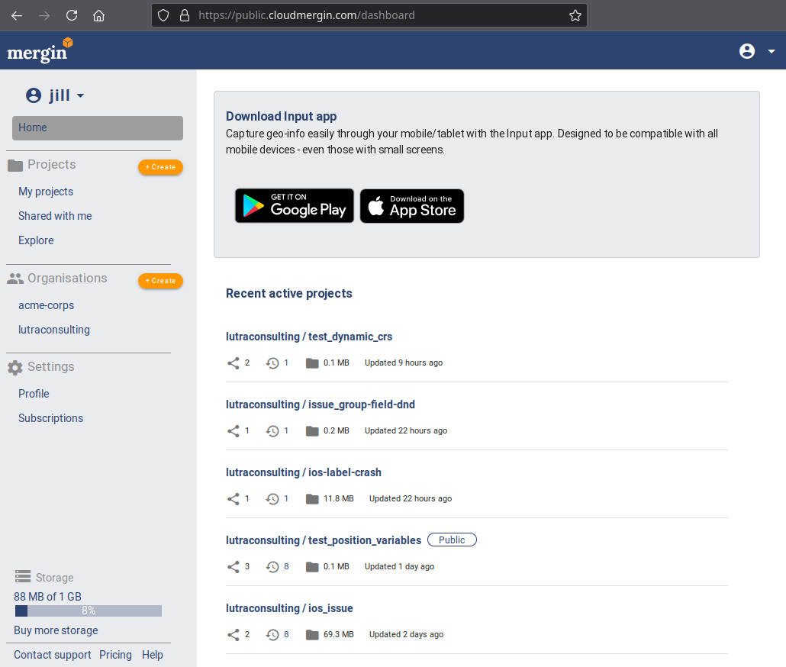
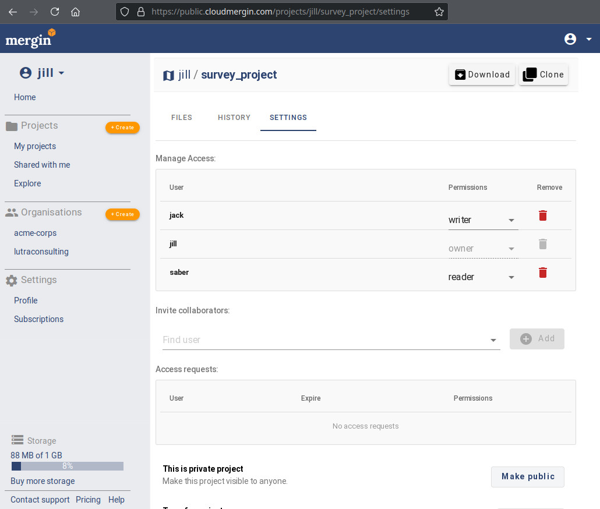
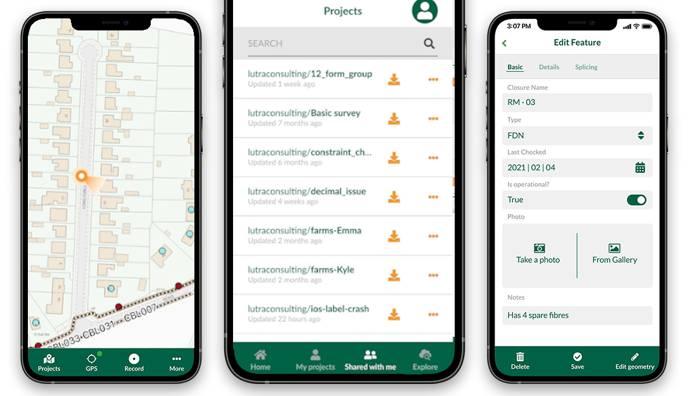
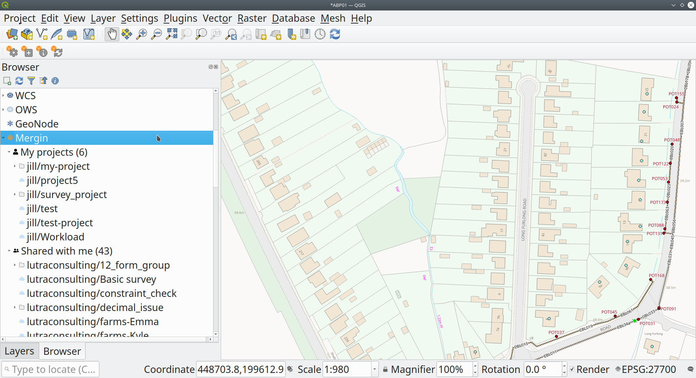

<p align="center">
<a href="https://public.cloudmergin.com/" target="_blank">

</a>
</p>

<p align="center">
	<b>Store and track changes to your geo-data</b>
</p>

<p align="center">

</p>

## About

Mergin is a web platform for storage and synchronisation of geospatial projects across multiple users and devices (desktop and mobile).
The platform is especially useful when you need:

- **Mobile data collection.** If you need to capture location of assets (and their attributes) or update an existing database.

- **Data sharing.** No complicated setup of access by IT admins to get your data to colleagues or clients. Set up permissions and send invites with few clicks.

- **Offline access.** Work with data with no interruption even without constant Internet connection - sync any changes when you are back online.

- **Collaborative editing.** No more problems dealing with multiple copies of the same dataset in different versions - all changes are automatically consolidated in one place.

- **Audit changes.** Knowing who has changed what and when in a database is often important - Mergin keeps track of the history and allows to go back if needed.

- **No coding required.** Everything can be set up with no knowledge of programming.

Mergin organises all data in projects. A project in Mergin is a directory containing various data files - GeoPackages,
QGIS project files, documents, pictures and more. As soon as a project is uploaded to Mergin, it can be easily accessed directly from the web, from QGIS or from iOS/Android via [Input app](https://inputapp.io/).

## Screenshots

<p align="center">
<b>Mergin web</b><br>
<table align="center">
<tr>
	<td align="center"><br>Dashboard</td>
	<td align="center"><br>Project files</td>
</tr>
<tr>
	<td align="center"><br>Project version history</td>
	<td align="center"><br>Project settings</td>
</tr>
</table>
</p>

<p align="center">
<b>Mergin in <a href="https://inputapp.io/">Input app</a></b><br>

</p>

<p align="center">
<b>Mergin in QGIS</b><br>

</p>

## Features

- 🌍 **Store data** - GeoPackages, QGIS project files, GeoTIFFs, pictures or any other data easily
- 📱 **Mobile devices** - Great for working on field surveys, thanks to [Input app](https://inputapp.io/) based on QGIS, for [iOS and Android](https://github.com/lutraconsulting/input)
- 🌟 **QGIS integration** - [Mergin plugin](https://github.com/lutraconsulting/qgis-mergin-plugin) is available to help with project setup and seamless syncing within QGIS
- 👥 **Multi-user editing** - Changes to vector/attribute data from multiple users are automatically merged
- 📖 **Data versioning** - Keeping history of all changes, allowing to go back if needed
- 🔌 **Offline editing** - Clients do not need to be online all the time - only when syncing changes
- 🌱 **Sharing with collaborators** - Projects can be shared with other team members
- 🏰 **Granular permissions** - Decide who can read, write or manage projects
- 🌈 **Web interface** - Simple user interface to view and manage projects
- ⚡️ **Fast** - Efficient sync protocol transfering data between clients and server
- 🧑‍💻 **Developer friendly** - Mergin is open platform. CLI tools and client libraries available for [Python](https://github.com/lutraconsulting/mergin-py-client) and [C++](https://github.com/lutraconsulting/mergin-cpp-client)
- 💽 **Sync with database** - Supporting two-way sync of data with PostGIS using [mergin-db-sync](https://github.com/lutraconsulting/mergin-db-sync) tool
- 👷‍♀️ **Work packages** - Split main database to smaller chunks for teams using [mergin-work-packages](https://github.com/lutraconsulting/mergin-work-packages) tool

Mergin offers a unique combination of features that other tools do not provide out of the box:

- relational databases (such as PostGIS or Oracle) are great for keeping a central repository of spatial data, but offline access, versioning and sharing outside of a single organisation are complicated to set up.

- traditional storage products (like Dropbox or Google Drive) are great for storage of large amounts of data (pictures/videos) and offering offline access, but concurrent access to data (e.g. a single vector layer) is not going to work well.


## Quick start

Try Mergin at https://public.cloudmergin.com/ - the SaaS service run by Lutra Consulting, the makers of Mergin.

### Running with Docker

Run Mergin locally is easy. Adjust configuration in [docker-compose.yml](docker-compose.yml), e.g. replace 'fixme' entries
and run with `docker-compose`:
```shell
$ docker-compose up
$ docker exec -it mergin-server flask init-db
$ docker exec -it mergin-server flask add-user admin topsecret --is-admin --email admin@example.com
$ sudo chown -R  901:999 ./projects/
$ sudo chmod g+s ./projects/
```
Projects are saved locally in `./projects` folder.

## Documentation

For user help and documentation, visit https://help.cloudmergin.com/
If you'd like to contribute and improve the documentation visit https://github.com/lutraconsulting/mergin-docs

For the Input mobile app, visit https://inputapp.io/ - with more documentation at https://help.inputapp.io/

## Get in touch

If you need support, a custom deployment, extending the service capabilities and new features do not hesitate to contact us on info@lutraconsulting.co.uk

## Developers

Contributions are welcome!

More information for developers can be found in the dedicated [development](development.md) page.

Client side modules:
- [Python](https://github.com/lutraconsulting/mergin-py-client) client library + CLI
- [C++](https://github.com/lutraconsulting/mergin-cpp-client) client library + CLI

More related tools:
- [mergin-db-sync](https://github.com/lutraconsulting/mergin-db-sync) - set up two-way sync between Mergin and PostGIS database
- [mergin-work-packages](https://github.com/lutraconsulting/mergin-work-packages) - split data for teams to work packages

Learn more about [geodiff](https://github.com/lutraconsulting/geodiff) - the low-level library providing seamless merging of changes from multiple sources.

## License

Mergin is open source and licensed under the terms of AGPL licence.
